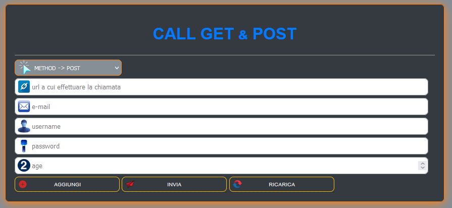

<link rel="shortcut icon" href="img/sun.png" type="image/x-icon" sizes="16x16">

## APP TESTING GET AND POST

app per testare le chiamate GET &amp; POST
 
 => ESEMPIO DI COME SCRIVERE LA PAGINA CHE RICEVE LE CHIAMATE GET E POST:
 

## INIZIO ##

< ? php
<ul>
    <li>header('Access-Control-Allow-Origin: *'); // IMPORTANTE CORS “Access-Control-Allow-Origin” mancante</li>
    <li>header ("Access-Control-Expose-Headers: Content-Length, X-JSON");</li>
    <li>header ("Access-Control-Allow-Methods: GET, POST, PATCH, PUT, DELETE, OPTIONS");</li>
    <li>header ("Access-Control-Allow-Headers: Content-Type, Authorization, Accept, Accept-Language, X-Authorization");</li>
    <li>header('Access-Control-Max-Age: 86400');</li>
    <li>header('Content-Type: application/json; charset=UTF-8');</li>
 </ul>
 <ul>
    <li>echo '[{</li>
            <li>"id": 101,</li>
            <li>"email" : "mariorossi@gmail.com",</li>
            <li>"usr": "Mario Rossi",</li>
            <li>"psw": "'.sha1("oxnde7n39").'",</li>
            <li>"age": 22</li>
        <li>},</li>
        <li>{</li>
            <li>"id": 102,</li>
            <li>"email" : "mariobianchi@gmail.com",</li>
            <li>"usr": "Mario Bianchi",</li>
            <li>"psw": "'.sha1("123abc").'",</li>
            <li>"age": 25</li>
        <li>},</li>
        <li>{</li>
            <li>"id" : "'.$_POST['id'].'",</li>
            <li>"email" : "'.$_POST['email'].'",</li>
            <li>"usr": "'.$_POST['usr'].'",</li>
            <li>"psw": "'.sha1($_POST['psw']).'",</li>
            <li>"age": "'.$_POST['age'].'"</li>
        <li>}</li>
    <li>]';
    <li>? ></li>
</ul>

 
<a href="https://ivanpierdeveloper.github.io/call-get-post/" target="_blank">Vai all'APP ^__^</a>

<!--  -->

NOTA: Se non dovesse funzionare, controllare di aver scritto correttamente l'url, consentire contenuti misti (es. http https (disabilitando il lucchetto nella barra degli indirizzi)) e per ultimo ma non per questo meno importatnte verificare CORS. Quest'ultimo si risolve installando un addons di FireFox <a href="https://addons.mozilla.org/it/firefox/addon/cors-everywhere/">installa(CORS)</a>. buon lavoro.

## FINE ##
