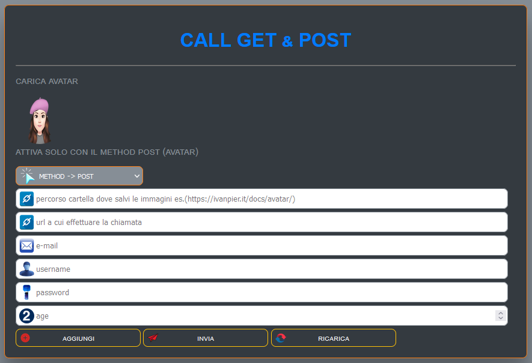

<link rel="shortcut icon" href="img/sun.png" type="image/x-icon" sizes="16x16">

## APP TESTING GET AND POST

app per testare le chiamate GET &amp; POST
 
 => ESEMPIO DI COME SCRIVERE LA PAGINA CHE RICEVE LE CHIAMATE GET E POST:
 

## INIZIO ##

<a href="docs/page/js.php">scarica file-1</a>

<a href="docs/page/get2.php">scarica file-2</a>

 
<a href="https://ivanpierdeveloper.github.io/call-get-post/" target="_blank">Vai all'APP ^__^</a>

<!--  -->

NOTA: Se non dovesse funzionare, controllare di aver scritto correttamente l'url, consentire contenuti misti (es. http https (disabilitando il lucchetto nella barra degli indirizzi)) e per ultimo ma non per questo meno importatnte verificare CORS. Quest'ultimo si risolve installando un addons di FireFox <a href="https://addons.mozilla.org/it/firefox/addon/cors-everywhere/">installa(CORS)</a>. buon lavoro.

## FINE ##
